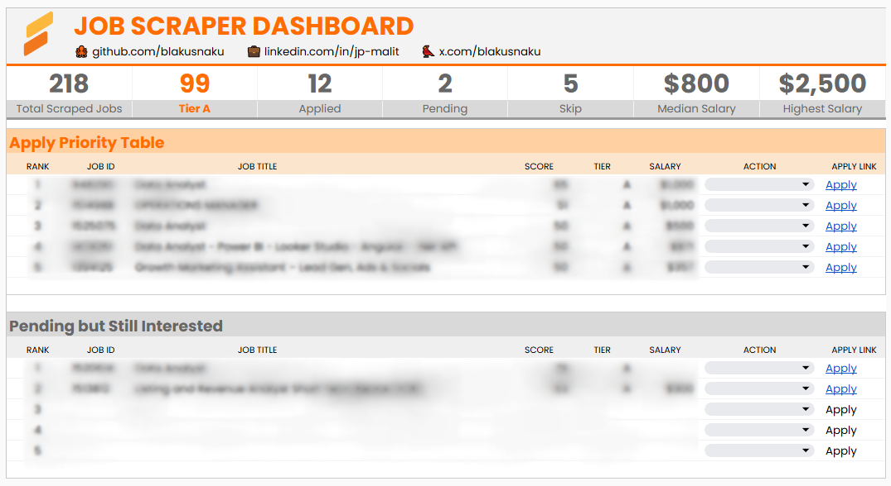

---

# 📊 Job Application Dashboard — Concept Showcase


A clean, ATS-style job application dashboard concept built using Google Sheets and workflow automation principles.

This repository presents a **safe, conceptual version** of an **internal tool** I use to organize daily job applications, evaluate opportunities efficiently, and stay consistent throughout my job search.

The real internal system includes:
- a daily scraper  
- Slack alerts  
- automation logic  
- evaluation heuristics  

…but these **are not included** here for privacy and compliance.  
This repo exists purely as a **portfolio showcase** to demonstrate the UI, workflow, and design approach.

---

## ⭐ Purpose

This dashboard began as a private internal tool built to streamline my job search.  
As the system matured, it became a great representation of my skills in:

- dashboard design  
- workflow automation  
- systems thinking  
- UX for decision-making  
- organizing pipelines and processes  

This public repository shares **the UI and concept only** — no sensitive logic, no datasets, no scraping code.

It is designed for employers, recruiters, and collaborators to see how I approach building practical tools.

---

## 🧭 What This Dashboard Does

### ✔ Prioritizes Job Listings  
Ranks roles by relevance to surface the strongest opportunities.

### ✔ Automatically Scrapes Jobs Daily *(internal tool — concept only shown here)*  
A private backend retrieves new job postings every day and feeds them into the dashboard.

### ✔ Slack Notifications for New Tier A Jobs *(internal tool — concept only shown here)*  
The internal system triggers Slack alerts whenever a high-quality ("Tier A") job is found.

### ✔ Tracks Application Status  
Maintains real-time counts for:
- Applied  
- Pending  
- Skip  

### ✔ Provides Instant Actions  
Dropdown-based controls:
- **Apply**
- **Pending**
- **Skip**

Actions update tables and KPIs automatically.

### ✔ Displays Key KPIs  
- Total Listings  
- Tier A  
- Applied  
- Pending  
- Skip  
- Median Salary  
- Highest Salary  

### ✔ ATS-Style Interface  
Structured similarly to professional hiring tools like Lever or Greenhouse.

---

## 🖥️ Dashboard Preview

*(Sensitive job information is blurred for privacy.)*



---

## 🔸 Design Principles

### **1. Clarity**
The UI focuses attention on decisions, not noise.

### **2. Speed**
Minimal friction — review jobs in seconds with dropdown actions.

### **3. Structure**
A clear pipeline:
```
Priority → Pending → Applied/Skip
```

### **4. Privacy**
No real job data or internal logic is exposed.

---

## 🧩 High-Level Workflow (Concept Only)

```text
Daily Backend Scraper (Internal)
        ↓
Job Data Synced to Google Sheets Dashboard
        ↓
Priority Table → (Apply / Pending / Skip)
        ↓
KPI Updates
        ↓
Slack Alert for New Tier A Jobs (Internal)
```
This is the high-level workflow used internally — the repo shows only the conceptual interface.

---

## 📁 Repository Structure

```
job-dashboard-concept/
│
├── README.md
│
├── screenshots/
│   └── dashboard_blurred.png
│
└── docs/
    ├── concept_overview.md
    ├── workflow_summary.md
    └── ui_design_principles.md
```
Important:
- ❌ No scraping logic
- ❌ No datasets
- ❌ No formulas
- ❌ No Apps Script
- ✔ Concept UI only

---

## 🛡️ Privacy, Ethics & Intent

This project is shared responsibly.
- All data shown is blurred
- Backend systems are private
- Platform terms are respected
- This repo is intended solely for portfolio demonstration
- No part of the internal automation pipeline is exposed

---

## 🟠 Author

**JP Malit**
Data Analyst • Workflow Automation Builder • Dashboard Designer
- GitHub: https://github.com/blakusnaku
- LinkedIn: https://www.linkedin.com/in/jp-malit

If you'd like to explore more of my automation or analytics concepts, feel free to connect!